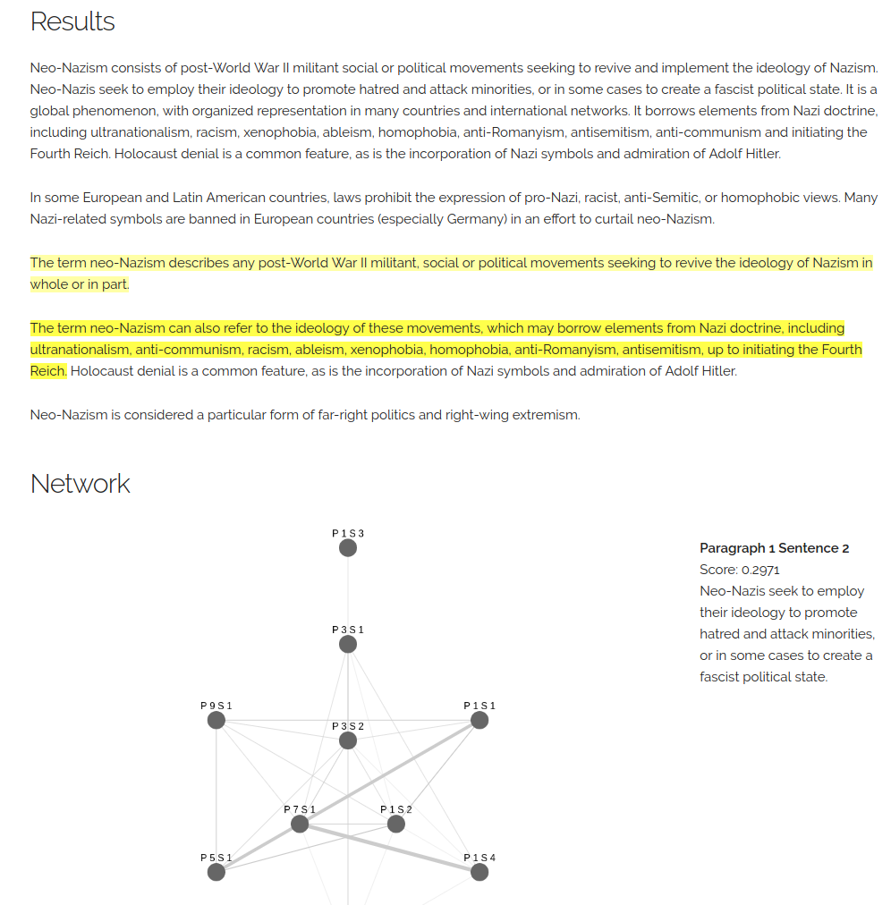

# TextRank Demo

A simple website demonstrating TextRank's extractive summarization capability.

## Usage

* This project uses Starlette (a lightweight ASGI framework/toolkit), so **Python 3.6+** is required.

* Install dependencies by running `pip install -r requirements`. 

* Start the demo server by running `python demo.py`, and then visit `http://localhost:8000` in your browser.

(Depending on your Python setup, you might need to replace `pip` with `pip3`, and `python` with `python3`.)

WARNING: At the current state, the backend does almost to none input value validation. Please do not anticipate it to have production quality.

## Snapshot

[A static snapshot of the website](https://publicb2.ceshine.net/file/ceshine-public/misc/textrank_demo.html) with an example from Wikipedia:

