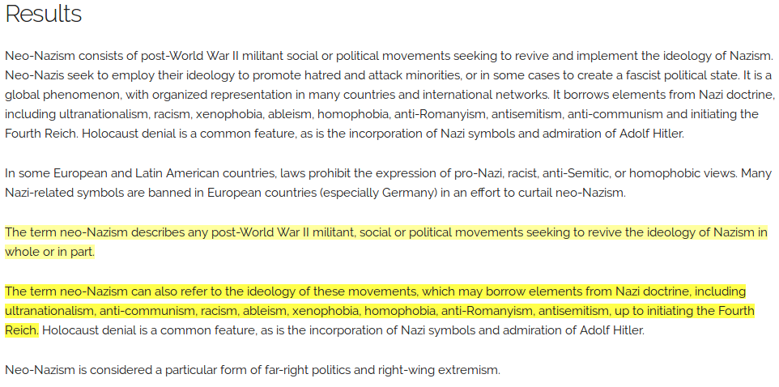
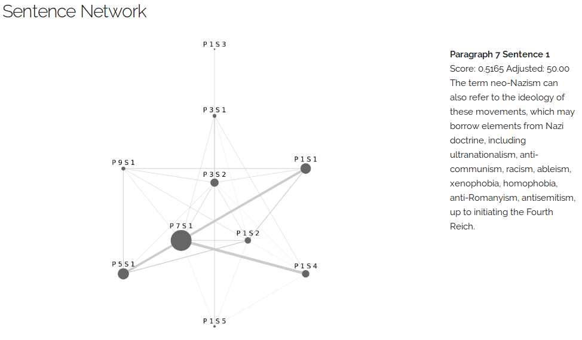
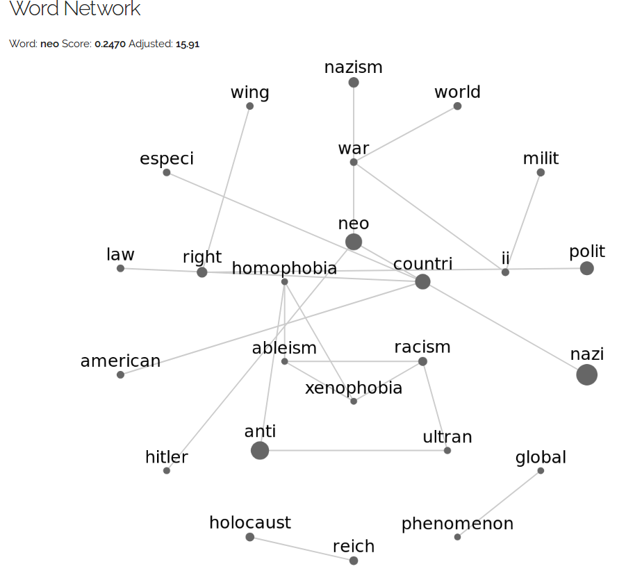
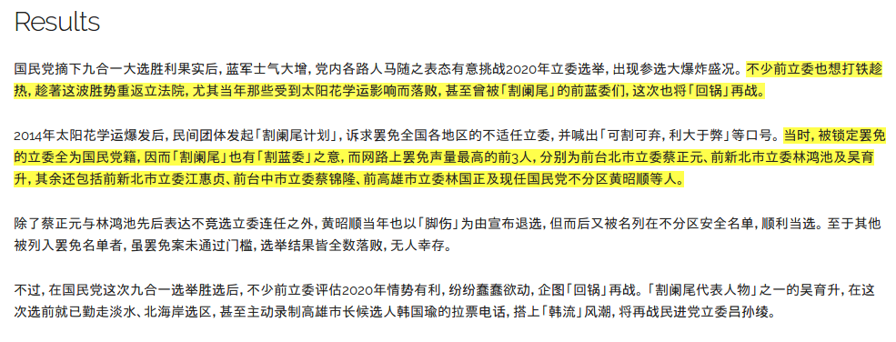
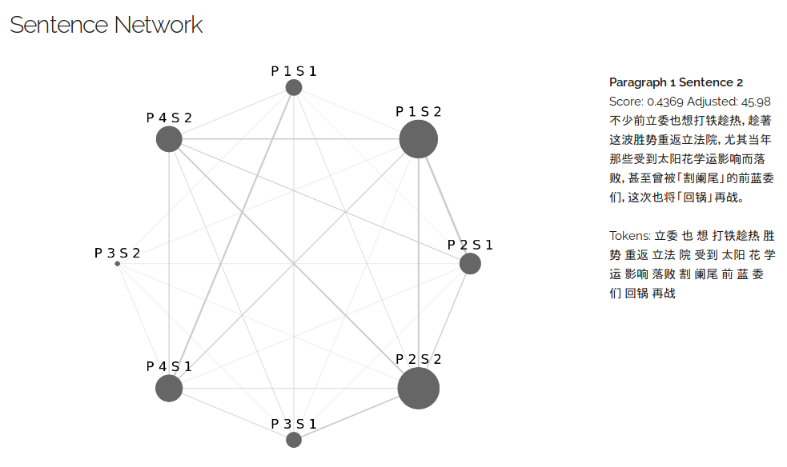
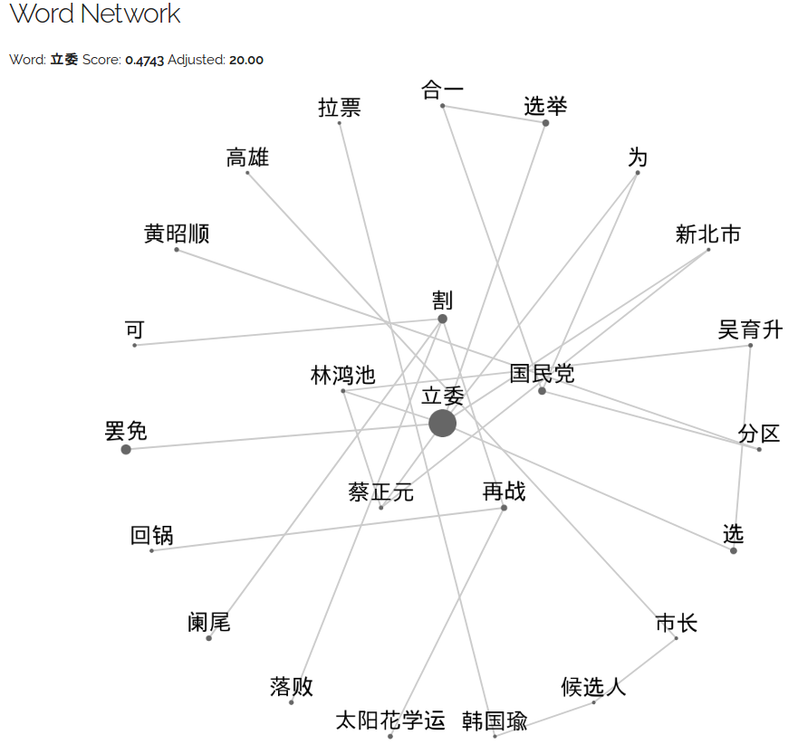
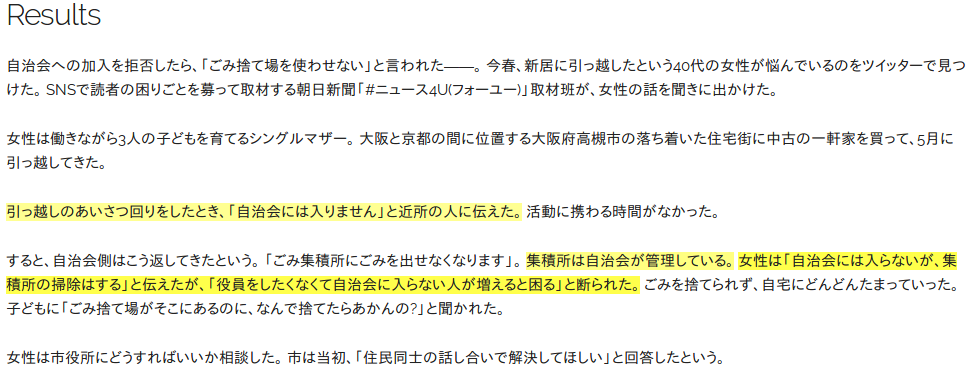
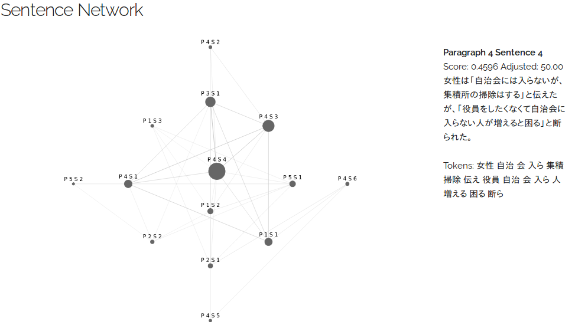
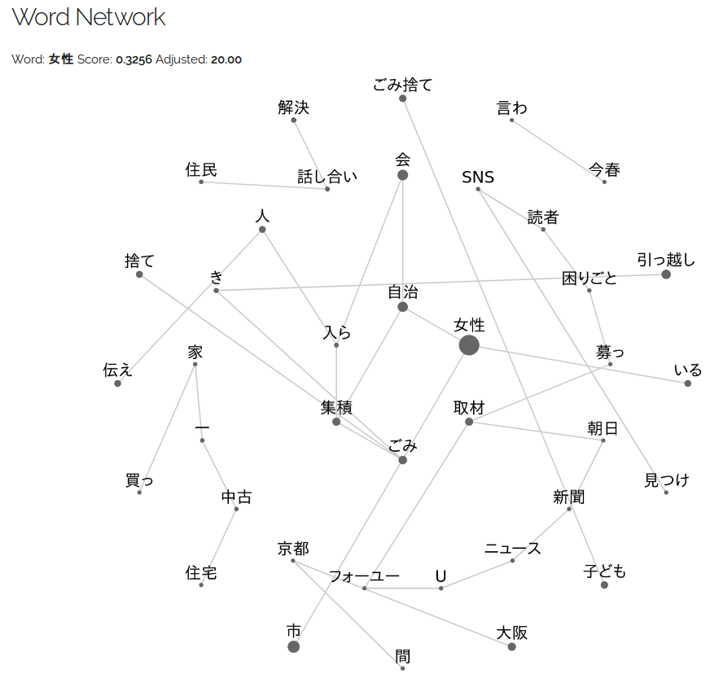

# TextRank Demo

A simple website demonstrating TextRank's extractive summarization capability. Currently supports English and Chinese.

## Major updates

### March 2021

- I deployed a version of this demo that has USE and LASER removed on [textrank-demo.veritable.pw](http://textrank-demo.veritable.pw). Now you don't have to build a Docker image locally to try this demo.
- The code behind this version is at the [heroku](https://github.com/ceshine/textrank_demo/tree/heroku) branch. As the name suggests, I use a Heroku free dyno to run the server, so **the first request might take some time to be served**.

### September 2019

- I managed to find the exact setup that **makes Universal Sentence Encoder work** and put it in [Dockerfile.use_cpu](Dockerfile.use_cpu). The main issue was that `tf-sentencepiece` doesn't work with Python 3.7. Downgrading to Python 3.6 solves the problem for me.

### June 2019

- Add [LASER sentence encoder](https://github.com/facebookresearch/LASER)(multi-lingual). LASER has rather complicated installation steps, so a dedicated Dockerfile([Dockerfile.laser_cpu](Dockerfile.laser_cpu)) is provided.
- `Xling` variant of Universal Sentence Encoder stops working due to some problem of `tf-sentencepiece` package despite the same version specification in `requirements.txt`. It has happened before and fixing it was really annoying. Since Google has dropped support for this integration, it's unlikely to get better (see the quote below). I decided to drop the official support of `Xling`. It's still on the demo page as an encoder option, but expect it to fail.

> We will be no longer supported direct integration with Tensorflow. Tensorflow users are suggested to adopt the new Tokzenization ops published as part of TF.Text. Those ops will soon support running pre-trained SentencePiece models. ([source](https://github.com/google/sentencepiece#tensorflow-module))

### April 2019

- Similarity metrics using the Universal Sentence Encoders from Tensorflow Hub has been added. Use the "Similarity Metric" dropdown menu to switch between models.

- All USE models supports English, but **only the `Xling` variant supports Japanese and Chinese**.

- A Dockerfile([Dockerfile.cpu](Dockerfile.cpu)) has been added for easier reproduction. Because the "base" model only supports CPU version of Tensorflow, at this moment we don't provide a GPU version of the Dockerfile.

- Use spacy to segment sentence for English texts.

## Usage

WARNING: At the current state, the backend does almost to none input value validation. Please do not anticipate it to have production quality.

### Docker (Recommended)

Two options for you:

1. Dockerfile.cpu: No LASER support. Classic textrank, USE-base and USE-large work.
2. Dockerfile.laser_cpu: Classic textrank, USE-base, USE-large, and LASER work.

(USE-xling probably won't work in both cases due to reason described in the June 2019 update log.)

Build the docker image using:

```bash
docker build -t <name> -f <Dockerfile.cpu or Dockerfile.laser_cpu> .
```

Start a container using:

```bash
docker run -u 1000:1000 --rm -ti -p 8000:8000 -e TFHUB_CACHE_DIR=/some/path/tf_hub_cache/ -e BAIDU_APP_ID=<ID> -e BAIDU_APP_KEY=<key> -e BAIDU_SECRET_KEY=<secret> -v /some/path:/some/path <name>
```

If you're not feeding Chinese text to the server, you can skip BAIDU related environment variables. Setting `TFHUB_CACHE_DIR` is recommended to save the time by avoiding downloading the models every time you start a new container.

Visit `http://localhost:8000` in your browser.

### Local Python Environment

- This project uses Starlette (a lightweight ASGI framework/toolkit), so **Python 3.6+** is required.

- Install dependencies by running `pip install -r requirements.txt`.

- Start the demo server by running `python demo.py`, and then visit `http://localhost:8000` in your browser.

(Depending on your Python setup, you might need to replace `pip` with `pip3`, and `python` with `python3`.)

### API server

There's a very simple script([api.py](api.py)) to create a api server using [fastapi](https://github.com/tiangolo/fastapi). It might be a good starting point for you to expand upon (that's what I did to create a private textrank api server).

## Languages supported

### English

Demo: **[A static snapshot](https://publicb2.ceshine.net/file/ceshine-public/misc/textrank_demo.html) with an example from Wikipedia.**

This largely depends on language preprocessing functions and classes from [summanlp/textrank](https://github.com/summanlp/textrank). This project just exposes some of their internal data.

Accoring to [summanlp/textrank](https://github.com/summanlp/textrank), you can install an extra library to improve keyword extraction:

> For a better performance of keyword extraction, install Pattern.

From a quick glance at the source code, it seems to be using Pattern (if available) to do some POS tag filtering.

### Chinese

Demo: **[A static snapshot](https://publicb2.ceshine.net/file/ceshine-public/misc/textrank_demo_zh.html) with an example from a news article.**

This project uses [Baidu's free NLP API](https://cloud.baidu.com/product/nlp) to do word segmentation and POS tagging. You need to create an account there, install the Python SDK, and set the following environment variables:

- BAIDU_APP_ID
- BAIDU_APP_KEY
- BAIDU_SECRET_KEY

You can of course use other offline NLP tools instead. Please refer to `test_text_cleaning_zh.py` for information on the data structures expected by the main function.

Traditional Chinese will be converted to Simplified Chinese due to the restrictions of Baidu API.

### Japanese

Demo: **[A static snapshot](https://publicb2.ceshine.net/file/ceshine-public/misc/textrank_demo_ja.html) with an example from a news article.**

It uses [nagisa](https://github.com/taishi-i/nagisa) to do word segmentation and POS tagging. There are some Japanese peculiarities that make it a bit tricky, and I had to add a few stopwords go get more reasonable results for demo. Obviously there is much room of improvement here.

## Snapshots

### English







### Chinese







### Japanese






